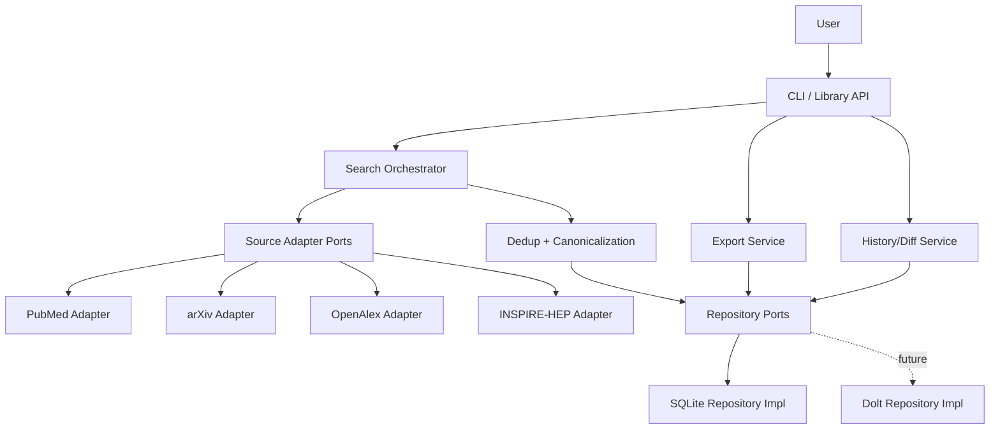

# DES-001: Scitadel Phase 1 Architecture

<!-- markdownlint-disable MD022 MD032 MD060 -->

| Field | Value |
|---|---|
| **Status** | proposed |
| **Created** | 2026-02-26 |
| **Updated** | 2026-02-26 |
| **RFC** | `docs/rfcs/RFC-001-2026-02-26-scitadel-problem-space.md` |

## Overview

This design defines the Phase 1 system architecture for Scitadel, based on RFC-001.
The goal is to deliver a local-first, reproducible federated literature search engine
with structured export, while preserving clean extension points for Phase 2+ features
(LLM integration and citation chaining).

### Scope alignment

In scope:
- Tier 1 source adapters (PubMed, arXiv, OpenAlex, INSPIRE-HEP)
- Federated search orchestration
- Deduplication and canonicalization
- Local-first persistence and search history
- DB-backed export (BibTeX, JSON, CSV)
- CLI + library API parity

Out of scope:
- Built-in LLM scoring
- Citation chaining
- UI/MCP layers
- Runtime citation/similarity graph rendering (Phase 3+)

## Architecture Approach

### Selected pattern

Scitadel Phase 1 uses a **Modular Monolith with Hexagonal boundaries (Ports and Adapters)**.

Why this pattern:
- Delivers quickly for a solo developer without distributed-system overhead
- Enforces adapter/repository boundaries needed for API and storage evolution
- Keeps CLI and library APIs thin over the same application services
- Preserves a clear path to add asynchronous internals later without a rewrite

### Pattern alternatives considered

| Pattern | Pros | Cons | Fit for Phase 1 constraints | Complexity |
|---|---|---|---|---|
| Modular monolith | Fast iteration, low ops burden | Needs strict module boundaries | Good | Low-Med |
| Hexagonal architecture | Testability, swappable adapters | More upfront abstractions | Good | Med |
| Event-driven pipeline | Good for async workloads | Adds infra/observability complexity | Partial (Phase 2+) | Med-High |
| Microservices | Independent scaling/deploys | High operational cost for MVP | Poor | High |

Decision: combine modular monolith + hexagonal boundaries now; defer broker-backed event-driven architecture.

## System Context

Scitadel is a Python package with two entry surfaces:
- `scitadel` CLI commands (`search`, `history`, `export`)
- Importable Python API (same capabilities as CLI)

Both call the same application services. Core data is persisted to local DB first.
Exports are projections from persisted DB records only.

## Components

### 1) CLI and Library API

Responsibility:
- Parse user input and route to application services
- Present command output and errors

Interface:
- CLI commands and typed Python functions

Implementation notes:
- CLI remains a thin wrapper; business logic lives outside command handlers

### 2) Search Orchestrator (Application Service)

Responsibility:
- Execute a search run across selected sources
- Manage concurrency, timeouts, retries, and partial-failure behavior
- Build immutable run metadata

Interface:
- `run_search(query, sources, parameters) -> search_id`

Implementation notes:
- Adapter calls run in parallel
- Failures from one source do not abort all sources

### 3) Source Adapter Ports + Implementations

Responsibility:
- Translate canonical search request into source-specific request syntax
- Normalize source responses into canonical candidate records

Interface:
- Port contract per source: `search(query, params) -> list[CandidatePaper]`

Implementation notes:
- Adapters are isolated modules
- OpenAlex can use `pyalex`; others use direct APIs/libraries as selected

### 4) Deduplication and Canonicalization

Responsibility:
- Merge records across sources into canonical `papers`
- Maintain source provenance and per-source metadata

Interface:
- `merge_candidates(candidates) -> CanonicalBatch`

Implementation notes:
- DOI exact match first
- Fuzzy title matching as fallback
- Deterministic matching rules (versioned in code)

### 5) Repository Ports + DB Implementations

Responsibility:
- Persist and query `papers`, `searches`, `search_results`, `research_questions`, `search_terms`, `assessments`
- Provide stable persistence API independent of DB engine

Interface:
- `PaperRepository`, `SearchRepository`, `AssessmentRepository`, etc.

Implementation notes:
- Phase 1 concrete implementation: SQLite
- Future implementation: Dolt-compatible repository
- No raw SQL in application service layer

### 6) Export Service

Responsibility:
- Generate BibTeX/JSON/CSV from persisted data

Interface:
- `export(search_id, format)` and filterable variants

Implementation notes:
- **DB-backed only**: exports read persisted canonical records and provenance links
- No direct export from transient in-memory adapter response objects

## Data Flow

### Happy path

1. User invokes `search` through CLI or library
2. Orchestrator records a new immutable search run
3. Adapters query each selected source in parallel
4. Results normalized into candidate records
5. Dedup/canonicalization merges into canonical papers
6. Repositories persist papers + search mapping + raw response metadata
7. User invokes `export` or `history`
8. Export/history services query DB and produce deterministic projections

### Error paths

- Adapter timeout/rate limit:
  - Source is marked partial-failure in run metadata
  - Remaining sources complete normally
- Persistence failure:
  - Search run marked failed; no “successful” export from transient memory
- Dedup conflict:
  - Deterministic tie-break rules apply; source provenance kept for audit

## Component Topology

Mermaid is used here for architecture documentation only. It is not the runtime graph renderer.

## Technology Stack Decisions

| Component | Choice | Build vs Buy | Rationale |
|---|---|---|---|
| Runtime | Python | Buy ecosystem | Matches team constraints and RFC |
| CLI | Typer/Click | Buy | Mature CLI tooling, thin command layer |
| HTTP | `httpx` | Buy | Async-friendly for concurrent source calls |
| OpenAlex | `pyalex` | Buy | Mature, reduces maintenance burden |
| PubMed/arXiv adapters | Custom module | Build | Controlled normalization and behavior |
| INSPIRE-HEP | Evaluate `inspy-hep`; fallback custom | Buy + Build fallback | Keep optional dependency path |
| Persistence | SQLite via repository ports | Buy stdlib + Build abstraction | Local-first and swappable |
| Export | Internal service + `bibtexparser` | Build + Buy helper | Deterministic DB-based projection |

## Testing Strategy

- Unit tests:
  - Adapter normalization logic
  - Dedup rule engine and deterministic tie-breaks
  - Export formatting by schema
- Integration tests:
  - End-to-end search across test fixtures
  - Persistence + history diff behavior
  - Export from stored search runs
- Contract tests:
  - Per-adapter response schema handling for external API drift

## Blind Spot Review

### Observability
- Structured logs with `search_id` correlation
- Per-adapter latency and status metrics in run metadata

### Security
- API keys via environment variables only
- Redaction of credentials from logs
- No full-text copyrighted storage beyond allowed OA policies

### Scalability
- Phase 1 target: local usage with bounded concurrent adapter calls
- Design allows future queue-backed async tasks for heavier workflows

### Reliability
- Retry with backoff for transient source errors
- Partial-failure tolerant federated search
- Immutable run records preserve forensic trail

### Data consistency
- Canonical paper identity maintained by deterministic dedup rules
- Provenance preserved in `search_results`

### Deployment and configuration
- Local package execution first
- Environment-based configuration (timeouts, rate limits, API keys)

### Monitoring and operations
- Initial focus on local diagnostics and run summaries
- Service-mode alerts deferred until hosted runtime exists

## Deviation Justification

### Deviation 1: No microservices in Phase 1

Standard pattern:
- Split adapters/orchestration/export into deployable services.

Why we deviate:
- Solo developer and MVP timeline favor reduced operational complexity.

Accepted risk:
- Single-process boundary mistakes can accumulate technical debt.

Mitigation:
- Enforce strict module boundaries and port contracts from day one.

### Deviation 2: No external message broker in Phase 1

Standard pattern:
- Event bus/queue for resilient async orchestration.

Why we deviate:
- Adds premature infrastructure overhead for current workload.

Accepted risk:
- Long-running tasks can block synchronous flows.

Mitigation:
- Keep orchestration abstractions queue-ready; introduce broker in Phase 2 as needed.

## Review Prompts

Architecture is ready for review. Validate:
- Are component boundaries right for your implementation style?
- Should Phase 1 include a minimal in-process task queue abstraction now?
- Do you want stricter export contracts (for example, mandatory `search_id`)?

## Implementation Issues

- Epic: [#1](https://github.com/vig-os/scitadel/issues/1)
- #2 — Bootstrap package/config/CLI skeleton
- #3 — Domain models and repository ports
- #4 — SQLite schema, migrations, repositories
- #5 — Adapter contract + PubMed vertical slice
- #6 — arXiv adapter
- #7 — OpenAlex adapter via PyAlex
- #8 — Spike: inspy-hep vs custom INSPIRE
- #9 — INSPIRE-HEP adapter
- #10 — Federated orchestrator with partial-failure handling
- #11 — Deterministic dedup and canonicalization
- #12 — DB-backed export service (BibTeX/JSON/CSV)
- #13 — CLI commands (`search`, `history`, `export`)
- #14 — E2E + adapter contract test suite

## Next Step

Planning is complete. Begin development by claiming unblocked issues in dependency order from the epic checklist.
